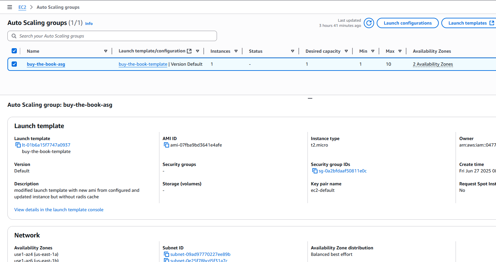

# AWS Two-Tier Scalable Architecture

Project Type: AWS Migration + Scalability Challenge
App: Buy the Book (Node.js/Express app)
Purpose: Migrate a legacy app from on-premise to AWS and scale it to handle 2 million users.

## **Project Overview**

This project documents my hands-on journey of migrating a Node.js/Express application from an on-premises environment to AWS, with the goal of making it scalable, fault-tolerant, and performance-optimized. This application needed to be re-architected to handle an anticipated spike to 2 million users during a major event. Working as a self-taught cloud engineer, I approached the challenge by applying AWS best practices across infrastructure, scaling, caching, and cost optimization.

## **Architecture**

The system is divided into multiple components, each handling a specific function. Below is an overview of the architecture:

```
project-root/
│
├── scripts/
│   ├── ec2-setup.sh              # configuring the app
│   ├── pm2-startup.sh            # PM2 + startup script
│   ├── artillery-test.yml        # Artillery load testing config
│
├── nginx/
│   └── default.conf              # Nginx reverse proxy configuration
│
├── app/
│   └── dynamodb.js               # simulated DynamoDB client
│   └── book-log-route-snippet.js # Just the logging route
│
├── screenshots/
│   └── ...                       # UI proof of all AWS setups
│
└── README.md                     # You're reading this

```

## Architecture Overview

### Main Components:

- **EC2 (App Layer)** — Hosts the Node.js app, managed via PM2 and backed by AMIs.
- **RDS MySQL (DB Layer)** — Relational data store for books, authors, and cart details.
- **Application Load Balancer (ALB)** — Handles HTTP traffic and distributes across instances.
- **Auto Scaling Group (ASG)** — Automatically launches EC2 instances using the latest AMI.
- **S3 (Static Assets)** — Serves static files like CSS and JS.
- **CloudFront (CDN)** — Caches and globally distributes static content from S3.
- **DynamoDB (Simulated NoSQL layer)** — Logs simulated "book view" events.
- **CloudWatch (Monitoring)** — Monitors logs and metrics from EC2 and app layers.

---

## **Deployment Instructions**

## ✅ Task 1: Lift-and-Shift to AWS

- **Cloned and deployed** an existing Node.js/Express application (`Buy the Book`) to an EC2 instance using SSH and Git.
- **Installed and configured** all necessary dependencies, including Node.js, npm, Sequelize, MySQL2, Express, Handlebars, and PM2 for process management.
- **Created a production-ready environment**:
  - Used `PM2` to serve the app and ensure it restarts on reboot.
  - Configured `nginx` as a reverse proxy to forward HTTP requests to the Node.js app.
- **Lifted and shifted the database** to **Amazon RDS (MySQL)**:
  - Exported the local MySQL schema and imported it into a new RDS instance.
  - Updated Sequelize connection settings to point to the RDS endpoint.
- **Skipped Route 53 and custom domain setup** to reduce cost.
  - Instead, accessed the app via **EC2 public IP** and later through **ALB DNS**.
- **Created an AMI** of the configured instance for future scaling and recovery.

---

## ✅ Task 2: Horizontal Scaling with Auto Healing

- After lifting and shifting the app to EC2, I created a **custom AMI** with all our app configurations.
- From this AMI, we built a **Launch Template** and set up an **Auto Scaling Group (ASG)** behind an **Application Load Balancer (ALB)** to enable horizontal scaling.
- Initially, all ASG instances went **unhealthy**, and we couldn’t access the app via the ALB DNS.
- Why? Our Node.js app was **listening on port 8080**, but both **ALB and Target Group** were configured for **port 80**. So the health checks failed, and the app could only be viewed via the EC2 public IP by appending `:8080`.
- The solution: We installed **Nginx** and configured a **reverse proxy** to forward traffic from **port 80 to port 3000**, where the Node.js app was finally served.
- This made everything click. Health checks started passing, and we could access the app using both **ALB DNS** and **EC2 Public IP** — no `:8080` needed.
  **Major lesson:** Node apps often don’t expose port 80 by default, and reverse proxies are essential in production environments for clean routing and scalability.



---

## ✅ Task 3: Static Content Delivery & Caching Attempts

### 🔸 S3 + CloudFront

- Identified the app’s static assets (`/public/assets`) and prepared them for external hosting.
- Uploaded all relevant files (images, CSS, JavaScript) to **Amazon S3**.
- Set appropriate permissions for **public access** and ensured correct MIME types were served.
- Confirmed accessibility of files via **S3 object URLs** before proceeding.
- Created a **CloudFront distribution** connected to the S3 bucket.
- CloudFront was introduced to:
  - Enable **global content delivery** for faster page loads
  - **Offload static asset delivery** from the EC2 instance
- Updated all static asset references in `.handlebars` templates to use the **CloudFront URLs**.
- Verified that assets were loading correctly in browser dev tools (via the `cloudfront.net` CDN URL).
  **Result:** Clean separation of concerns. The EC2 instance now serves only dynamic content, while S3 + CloudFront handle all static delivery — simulating a real production workflow.

[Uploaded Static Assets](./screenshots/s3.png)
[CloudFront Distribution](./screenshots/cloudfrontdist.png)
[DevTool serving file from cloudfront.net](./screenshots/devtool.png)

---

### ❌ Lambda@Edge (Skipped)

- Not required for current use case:
  - No image resizing
  - No dynamic manipulation at edge locations
  - Would add unnecessary complexity

---

### ❌ Redis / ElastiCache (Rolled Back)

- Attempted to use **Redis** (ElastiCache / Valkey) to cache data.
- Launched a cluster, connected from app — but Redis integration triggered **runtime errors and crashes**.
- After debugging and assessing that the app didn’t benefit from caching, removed all Redis-related logic.
- Reverted to a stable AMI and moved forward.
  **Takeaway**: Use caching _strategically_. Not every app needs it — especially if it’s read-light and sessionless.

---

## ✅ Task 4: NoSQL Integration (Simulated) with DynamoDB

### 📦 Background

The original application didn't use any real books or user sessions, which made traditional NoSQL use cases (like shopping cart caching or user behavior logging) unnecessary.  
However, to **demonstrate AWS integration skills**, DynamoDB was introduced in a simulated capacity.

### ⚙️ Implementation Details

**Installed AWS SDK:**
npm install aws-sdk
Created dynamodb.js
Added route in server.js
**Example item stored:**
{
"userId": "guest",
"timestamp": "2025-06-23T23:55:12Z",
"bookId": "001"
}

[DynamoDB Table](./screenshots/dynamodb.png)

---

## ✅ Task 6: Load Testing with Auto Scaling

**Implementation Details**
Created a fresh AMI from the fully configured main EC2 instance
Updated Launch Template to use the new AMI version
Updated ASG to use this template and deleted all old, outdated EC2 instances
Allowed ASG to launch new, properly configured EC2 instances
✅ Ensured environment was clean and consistent before testing

**Used Artillery to simulate increasing traffic:**
First Test:

🔥 66,000 total requests

Response codes: 33k 200 OK, 33k 404 (book/001 doesn’t exist)

Result: App held steady, no instance scaled

Second Test:

🔥 168,000 total requests

84k 200 OK, 84k 404 (again due to book/001 not existing)

CPU usage was high, but ASG didn’t scale (threshold not met)

✅ EC2s handled massive load
❌ No new instance because scaling was based on CPU threshold

[Testing Traffic](./screenshots/index1.png)
[Result](./screenshots/finaltest.png)

---

## Future Upgrades

Migrate to microservices with ECS or Lambda
Enable Redis once app is stateless enough
Connect real books to DynamoDB or Aurora Serverless
Add CI/CD with GitHub Actions
Setup WAF and Route 53 when budget allows

---

## 💬 Questions or Feedback?

Reach me on GitHub or miracleosita355@gmail.com
